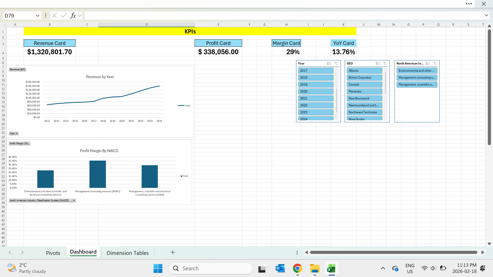

# Canadian Consulting Industry Financial Performance Analysis

## Project Overview
This project analyzes financial performance trends across Canada’s consulting industry using Excel Power Pivot and DAX.

The objective was to evaluate:
- Revenue growth trends
- Cost structure
- Profitability patterns
- Industry-level performance differences

## Tools Used
- Excel Power Query (Data Cleaning)
- Power Pivot (Data Modeling)
- DAX (Measures & KPIs)
- Interactive Dashboard

## Data Source
Statistics Canada – Consulting Services Financial Summary Dataset

## Data Model
A star schema was implemented:
- FactConsulting (Financial metrics)
- DimDate
- DimIndustry
- DimGeography
- DimMetric

## Key KPIs
- Revenue ($M)
- Profit ($M)
- Profit Margin (%)
- Revenue YoY Growth (%)

## Business Insights
- Identified high-revenue consulting segments
- Compared profitability across industries
- Analyzed cost structure (salary impact)
- Evaluated year-over-year growth trends

## Dashboard Preview

## Outcome
This analysis demonstrates financial modeling, DAX calculations, and dashboard design skills.
